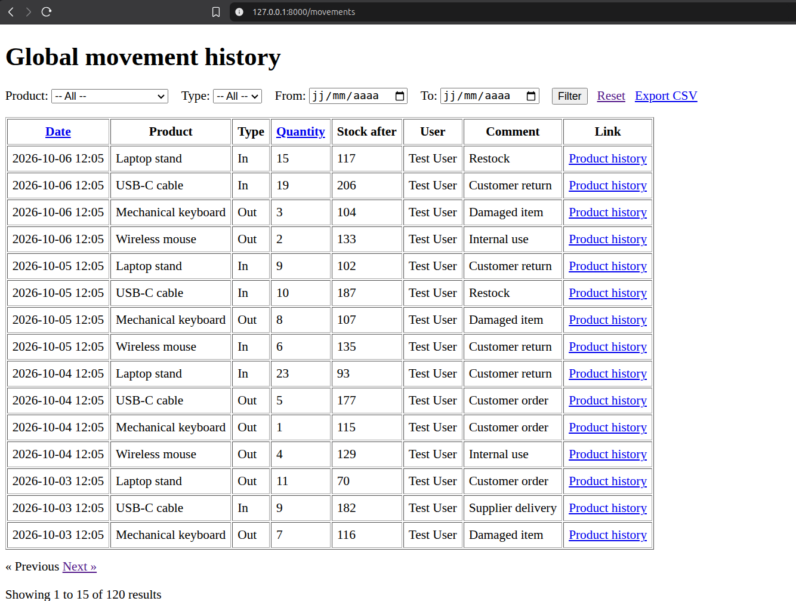
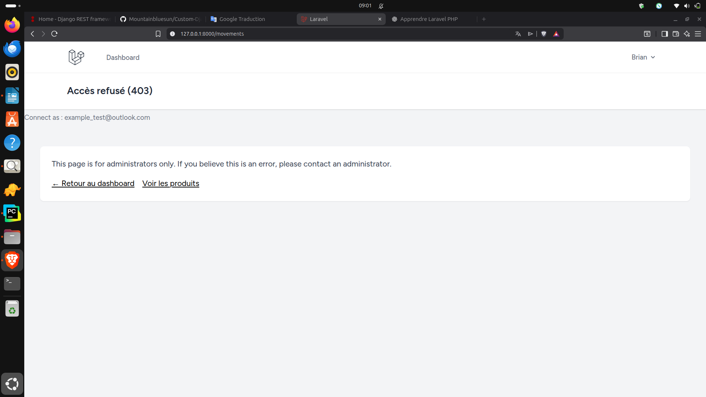

# Stock Manager – Laravel

Application de gestion de stock développée avec Laravel.
Ce projet sert de démonstration de mes compétences backend (CRUD, sécurité, tests, audit).

## 🚀 Fonctionnalités

- Gestion des produits (CRUD)
- Gestion des mouvements de stock (entrées / sorties)
- Calcul automatique du stock après chaque mouvement
- Historique global des mouvements
- Export CSV des mouvements (accès restreint)

## 🔐 Sécurité & Autorisations

- Authentification via Laravel Breeze
- Autorisations gérées avec **Policies**
- Accès restreint :
  - Utilisateurs standards : produits uniquement
  - Administrateur : accès à l’historique global et export CSV
- Middleware `can:` pour protéger les routes sensibles
- Page 403 personnalisée

## 🧪 Tests

- Tests fonctionnels avec **Pest**
- Vérification des accès :
  - 403 pour les non-admin
  - 200 pour l’admin
- Tests verts garantissant la sécurité des routes critiques

## Security & Authorization (Policies)

- Global movements page (`/movements`) and CSV export (`/movements/export`) are restricted to admins via Policy + `can:` middleware.
- Non-admin users receive a 403 page.
- Covered by Pest feature tests (403/200).

## 📸 Screenshots

### Admin – accès autorisé (200)


### User – accès refusé (403)


## 🛠️ Stack technique

- Laravel 12
- PHP 8.3
- SQLite
- Blade + Tailwind
- Laravel Breeze
- Pest

## ⚙️ Installation locale

```bash
git clone https://github.com/TON_PSEUDO/laravel-mini.git
cd laravel-mini
composer install
npm install
npm run build
php artisan migrate
php artisan serve
